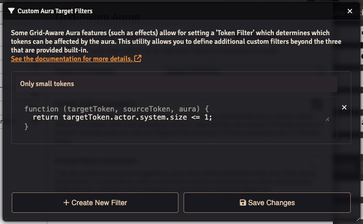

> [!NOTE]
> This is considered to be very advanced niche functionality. You should understand basic JavaScript and be aware of the nuances below before using this feature.

# Custom Aura Target Filters

Some automation features in Grid-Aware Auras allow specifying "Target Tokens", which is a filter that may limit which other tokens an automation can apply to. For example, setting up automation to apply a "Slowed" effect with Target Tokens set to "Hostile" will mean that only when a token with a disposition of Hostile enters the aura will the Slowed effect be applied - if a Friendly disposition token enters the aura, it won't be applied.

By default there are the following options:
- _All_ - which applies to any non-secret tokens.
- _Token Disposition_
	- _Friendly_ - Only applies to tokens with a friendly disposition.
	- _Netural_ - Only applies to tokens with a neutral disposition.
	- _Hostile_ - Only applies to tokens with a hostile disposition.
- _Actor Type_
	- An entry for each type of actor in your game system - Will only apply to tokens representing that type of actor.

In addition to the built-in filters, it is possible to use JavaScript to define custom filters. To do so, navigate to the Foundry settings, find the Grid-Aware Auras section, then next to "Custom Aura Target Filters" click the "Configure" button.

Within the window that opened, you can click "Create New Filter" to create a new blank filter. First, give it a useful name (this will appear in the _Target Tokens_ dropdown). Then, you need to write the JavaScript function. The function takes three parameters that you can use in your filter logic: `targetToken`, which is a reference the to Token that has entered or left the aura; `sourceToken`, which is a reference to the Token that owns the aura; and `aura` which is the actual configuration for the aura. If the value returned from the function is truthy, then the automation will run.

> [!IMPORTANT]
> One important thing to note about filters is that they only run when their associated trigger happens (e.g. when entering or leaving an aura). They do not run when a token within an aura is updated.
>
> For example, lets say you create a custom filter that will trigger automation if the health of a token's actor is less than 10 and set up an aura to apply a "Slowed" effect to tokens that match this filter. If the token entered with a health of 15, but was then lowered to 10 while, inside the aura, the "Slowed" effect would NOT be applied.

As an example, if you were using the Lancer game system, you might do something like this to create a filter that will only apply an effect to tokens that are size 1 or below:

