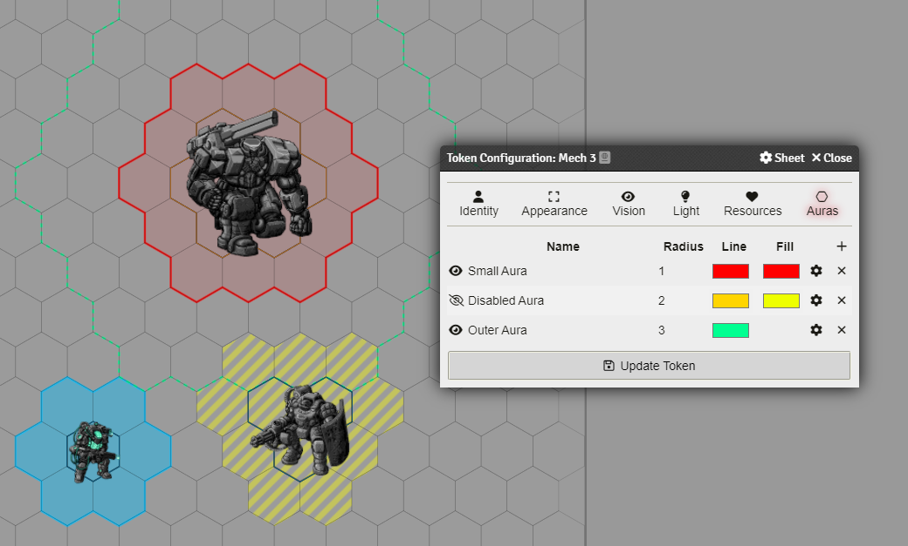
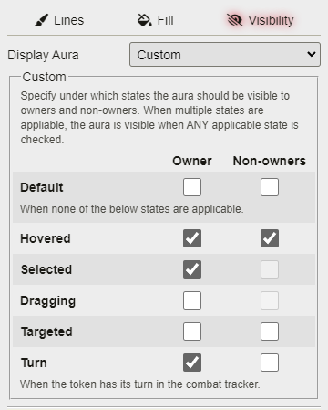
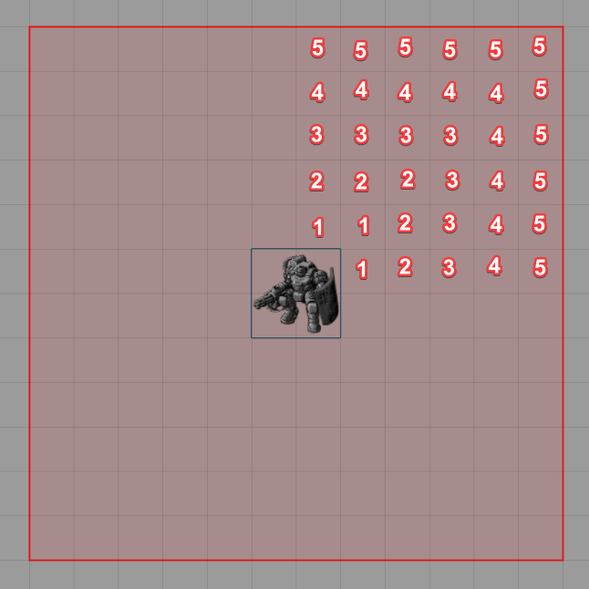
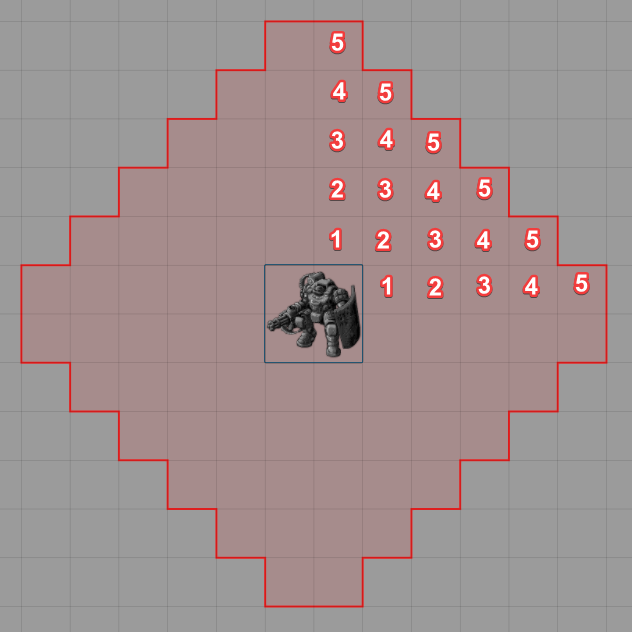
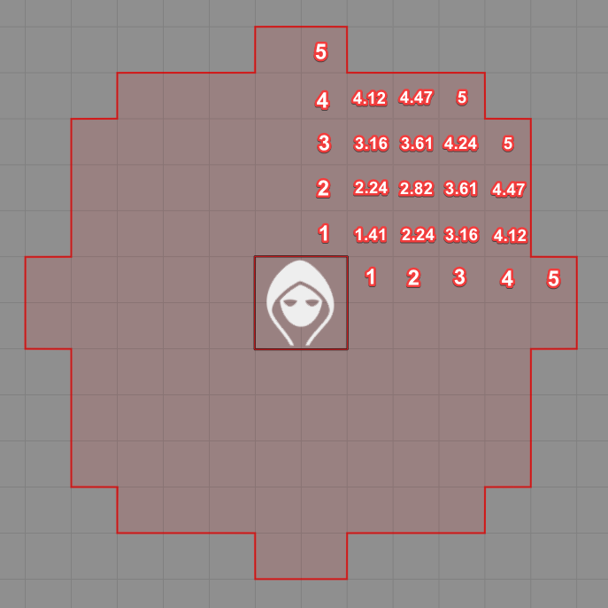

# Grid-Aware Auras

 
[)](https://github.com/Wibble199/FoundryVTT-Grid-Aware-Auras/releases/latest)
[)](https://github.com/Wibble199/FoundryVTT-Grid-Aware-Auras/releases/latest)

A module which draws grid-accurate auras around tokens, which supports any size token and has customisable display styles.

## Installation

Simply search for 'Grid-Aware Auras' in the Foundry 'Install Module' screen and install it from there.

Alternatively, paste this URL into the 'Manifest URL' field of the 'Install Module' dialog in the Foundry configuration: `https://github.com/Wibble199/FoundryVTT-Grid-Aware-Auras/releases/latest/download/module.json`, then enable the module in your world.

## Usage

1. First open a token configuration by using the cog button when right-clicking a token on the scene, or open the prototype token configuration for an actor.
2. Then, navigate to the new "Auras" tab, then click the `+` button to create a new aura. You can then set the [radius](#radius) of the aura, how you want it to appear visually, [when it should be visible](#visibility), and whether you want to add any [automation functionality](#automation). You can add as many auras as you want!
3. If you need to edit an existing aura, you can click the cog button next to it to edit it. You can also quickly toggle whether that aura is visible by clicking the eye icon.
4. Finally, just click the "Update Token" button.

### Radius

The radius of the aura can either be a number or a roll expression.

Roll expressions must be deterministic (i.e. not contain any dice expressions, for example). They are otherwise able to use any feature available to Foundry's rolls - including maths equations/functions.
Roll expressions can also access values on the actor or the item (for item auras). This is done by using `@actor.<path>` or `@item.<path>`. For example, if you were using the Lancer game system, you could use `@actor.system.sensor_range` to have a radius equal to a mech's sensors. The exact path will depend heavily on the game system you are playing.

On square and hexagonal grids, the final value will be rounded to the nearest whole number. On gridless scenes, this can be a decimal value.
If the final value is less than 0, the aura will not be drawn.

### Visibility

By default, newly created auras are visible to everyone so long as the token itself is visible. This can be changed in the 'Visibility' tab of the aura's config.

There are some options you can choose from in the dropdown, similar to the Foundry's default "Display Bar" option for token resource bars.

You can also fine-tune the visibility conditions, though this is a little more advanced:

The custom setting enables the checkbox table below the dropdown. This table shows a list of 'states' in the first column, followed by a checkbox for owner and non-owner visibility.

GAA computes visibility by checking which states are applicable, determining whether you are an owner of the token or not, then looking up whether the checkbox is ticked; If so, then the aura is visible. If there are multiple applicable states (for example targeted AND hovered), then the aura will show if ANY of the appliable states are ticked. The so-called 'Default' state is slightly special in that it applies ONLY when there are no other applicable states (i.e. when you are NOT hovering, and NOT targeting, and NOT the token's turn etc.).

In the above example, the aura is visible to a user when that user is hovering the token; OR when the token is selected/controlled (only possible by it's owner); OR if the user owns the token and it is that token's turn in the combat tracker.

### Automation

Automation is the broad category for doing things when tokens interact with auras. See the documentation for the various automation types offered:

- [Effects](./docs/automation.md#effects) - For automatically applying or removing active effects to tokens when tokens are inside auras.
- [Macros](./docs/automation.md#macros) - For running macros when events happen relating to auras.
- [Sequencer](./docs/automation.md#sequencer) (If the Sequencer module is installed) - For playing effects on tokens inside an aura.
- [Terrain Height Tools](./docs/automation.md#terrain-height-tools) (If THT module is installed) - For showing line of sight rulers while dragging tokens.

### Square Grids

When dealing with square grids, there are different ways of handling diagonals. You can configure which rules Grid-Aware Auras uses in the module settings. Which one you choose will depend on your game. GAA supports the following:

|Name|Picture|Description|
|-|-|-|
|Equidistant (1/1/1)||In this ruleset, moving diagonally always costs 1 (i.e. the same as moving horizontally or vertically). Therefore, the resulting aura ends up being a large square around the token. For example, this is how D&D5E usually works.|
|Alternating (1/2/1)||In this ruleset, the first diagonal costs 1, the second 2, the third 1 again, then 2 again, etc. This is the technique that Pathfinder 2E uses, for example.|
|Manhattan (2/2/2)||In this ruleset, diagonals are effectly disallowed. Moving 1 square diagonally would always cost 2 (1 horizontal and 1 vertical).|
|Exact (√2/√2/√2)||Also known as euclidean, this ruleset treats diagonals as √2. This is the same area you would get if you used Foundry's circle template tool with an equivalent radius from the centre of each cell.

_(Numbers are for illustrative purposes only)_

### Collision Detection

A quick note on collision detection: the collisions to test if a token is inside an aura is done by checking the centre of each cell under the token. For example, on a 3x3 token, the points tested would be here on hex and square grids (shown in red).

GAA does not check from the vertices of the token's border because rounding errors and imprecision with the geometry can cause false positives. It's far easier to just check the centre cells like this and in most cases it will make little difference. In future I _may_ change this or add alternative methods, but for now it will stay like this.

The exception to this is gridless scenes, which instead **do** check from the edge of the aura.

## See Also
- [Automation Guide](./docs/automation.md)
- [API Reference](./docs/api.md)
- [Hooks](./docs/hooks.md)
- [Custom Aura Target Filters](./docs/custom-aura-target-filters.md)

## Roadmap

Features that I will be looking to add to Grid-Aware Auras in future (in rough order of priority):

- [ ] Setting auras by active effects (e.g. allowing effects to alter the range of an aura).
